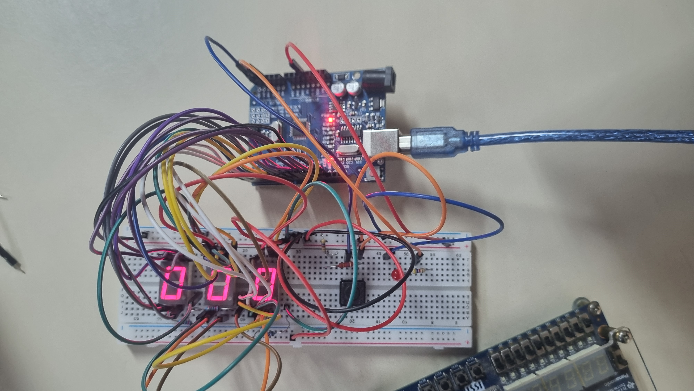

----------

# Testador de Tempo de Reação Arduino

Este projeto Arduino permite testar e melhorar seu tempo de reação usando um circuito simples com displays de sete segmentos.

----------

## Sumário

-   Sobre o Projeto
    
-   Funcionalidades
    
-   Requisitos de Hardware
    
-   Instalação
    
-   Uso
    
-   Visão Geral do Código

    

----------

## Sobre o Projeto

Este projeto implementa um testador básico de tempo de reação em uma placa Arduino. Ele mede o tempo que um usuário leva para pressionar um botão após uma pista visual. O tempo é então exibido em três displays de sete segmentos. O projeto também mantém o registro do seu melhor tempo.



----------

## Funcionalidades

-   **Medição do Tempo de Reação:** Mede com precisão o tempo de reação em milissegundos.
    
-   **Saída em Display de Sete Segmentos:** Exibe o tempo de reação claramente em dois dígitos.
    
-   **Rastreamento do Melhor Tempo:** Armazena e pisca o melhor tempo de reação alcançado.
    
-   **Interface Simples:** Fácil de usar com um único botão para interação.
    

----------

## Requisitos de Hardware

Para construir este projeto, você precisará dos seguintes componentes:
| Item                                | Quantidade | Preço Unitário | Preço Total | Observações                 |
| :---------------------------------- | :--------: | :------------- | :---------- | :-------------------------- |
| Arduino Uno R3                      | 1          | R$ 66,30       | R$ 66,30    | Inclui cabo USB             |
| Visor catódico de sete segmentos    | 3          | R$ 6,80        | R$ 20,40    |                             |
| Protoboard BB-01 840                | 1          | R$ 39,10       | R$ 39,10    |                             |
| Jumpers macho x macho               | 2          | R$ 7,00        | R$ 14,00    | 10 Jumpers por unidade      |
| Resistor 1.2k Ω 1W                  | 3          | R$ 0,40        | R$ 1,20     |                             |
| Botão 3MM 180GR Tower               | 1          | R$ 1,50        | R$ 1,50     |                             |
| Resistor 4.7k Ω 1W                  | 3          | R$ 0,40        | R$ 1,20     |                             |
| LED vermelho                        | 1          | R$ 0,50        | R$ 0,50     |                             |
| **Custo Total Estimado**            |            |                |**R$ 144,2** | (Excluindo o frete)         |
    

----------

## Instalação

1.  **Clone o Repositório:**
    
    Bash
    
    ```
    git clone https://github.com/PedroTiago23/Projeto_Eletronica_2025/Projeto_TempoDeReacao
    
    ```
    
2.  **Abra na IDE do Arduino:** Abra o arquivo `TempoReacaoArduino.ino` (ou o nome que você der ao seu arquivo de sketch principal) na IDE do Arduino.
    
3.  **Conecte o Hardware:** Monte seus componentes de acordo com o esquemático (consulte a seção "Diagrama de Circuito" abaixo para uma visão conceitual).
    
4.  **Carregue o Código:** Selecione sua placa Arduino e porta na IDE do Arduino e carregue o código.
    

----------

## Uso

1.  **Ligue:** Assim que o Arduino for ligado, os displays mostrarão "000".
    
2.  **Aguarde a Pista:** O LED (conectado ao A3) estará inicialmente desligado. Após um atraso (determinado pelo `delayTime = random(3000, 6000); delay(delayTime);` após o pressionamento do botão), o LED acenderá.
    
3.  **Pressione o Botão:** Assim que você vir o LED acender, pressione o botão.
    
4.  **Visualize o Tempo:** Seu tempo de reação em milissegundos será exibido nos displays de sete segmentos.
    
5.  **Indicação do Melhor Tempo:** Se o seu tempo de reação atual for melhor que o tempo anterior, o novo melhor tempo piscará algumas vezes.
    
6.  **Repita:** O sistema então será reiniciado e você poderá testar seu tempo de reação novamente.
    

----------

## Visão Geral do Código

Aqui está uma breve explicação das principais funções no código fornecido:

-   `displayDigit(int number, int displayId)`: Esta função recebe um único dígito (`number`) e um `displayId` (0 para o dígito mais à direita, 1 para o mais à esquerda) e acende os segmentos correspondentes no display de sete segmentos. Assume que os segmentos estão conectados aos pinos digitais 0-6 para `displayId` 0 (que corresponde aos dois últimos displays) e 7-13 para `displayId` 1.
    
-   `resetDisplays()`: Limpa os displays de sete segmentos, mostrando "00" e configurando os pontos decimais (pinos A1 e A0) apropriadamente.
    
-   `turnOffDisplays()`: Desliga todos os segmentos e pontos decimais nos displays.
    
-   `blinkNumber(int numberToBlink)`: Pisca um determinado número três vezes nos displays. Isso é usado para destacar um novo melhor tempo.
    
-   `displayTime(int timeValue)`: Exibe um `timeValue` (até 999 milissegundos) nos três displays de sete segmentos. Se o `timeValue` for 1000 ou mais, ele exibe "999" com o ponto decimal para `displayId` 0 aceso para indicar um estouro.
    
-   `setup()`: Inicializa os pinos do Arduino, define o estado inicial do display e desliga o LED de sinalização de reação.
    
-   `loop()`: O loop principal do programa.
    
    -   Aguarda o botão ser liberado (`while (digitalRead(A5) == LOW) continue;`).
        
    -   Reinicia os displays.
        
    -   Um pequeno atraso (`delay(500);`) é introduzido.
        
    -   O `startTime` é registrado e o LED de sinalização de reação (conectado ao A3) é ligado.
        
    -   Em seguida, entra em um loop, calculando e exibindo continuamente o tempo decorrido até que o botão seja pressionado.
        
    -   Assim que o botão é pressionado, o LED de sinalização de reação é desligado.
        
    -   Compara o `currentTime` com o `bestTime`. Se for um novo melhor tempo, `blinkNumber()` é chamado.
        
    -   Um atraso de 1 segundo (`delay(1000);`) é adicionado antes da próxima rodada.
        

**Observação sobre o Mapeamento de Pinos:** O código assume atribuições de pinos específicas para os displays de sete segmentos e o botão. Por favor, consulte o seu diagrama de circuito para as conexões exatas. Os pinos usados são os digitais 0-13 e os analógicos A0, A1, A3, A4, A5.
